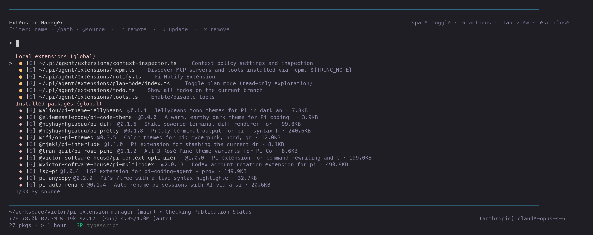

# pi-extension-manager

Interactive extension and package manager for [Pi](https://github.com/nicholasgasior/pi-coding-agent).

Provides an `/extensions` command to manage local extensions and community packages from within Pi.



## Install

```bash
pi install npm:@victor-software-house/pi-extension-manager
```

## Usage

```
/extensions              Open interactive manager
/extensions show         Summarize current state (counts, updates, cache)
/extensions list         List local extensions
/extensions installed    List installed packages
/extensions install <s>  Install a package (npm:, git:, or path)
/extensions remove <s>   Remove a package
/extensions update [s]   Update one or all packages
/extensions remote       Browse community packages
/extensions enable <n>   Enable a local extension
/extensions disable <n>  Disable a local extension
/extensions history      Show change history
/extensions auto-update  Configure auto-update schedule
/extensions verify       Check runtime dependencies (npm, paths)
/extensions path         Show config and data paths
/extensions reset        Reset settings to defaults
/extensions help         Show usage help
```

## Interactive manager

Main `/extensions` view shows local extensions and installed packages in a unified list with:

- Type-to-filter search (plain text, `/path`, `@source`)
- View modes: Tab cycles by-source / A-Z / active-first
- Toggle extensions with Space/Enter
- Package actions: update, remove, configure

## Prior art

This project is a rewrite of [pi-extmgr](https://github.com/ayagmar/pi-extmgr) by [@ayagmar](https://github.com/ayagmar), which provided original extension management UI and package operations for Pi. TUI pattern follows [pi-skills-manager](https://github.com/victor-software-house/pi-skills-manager).

## Development

```bash
pnpm install
pnpm run typecheck
pnpm run lint
pnpm run test
pnpm run build
```

## License

MIT
